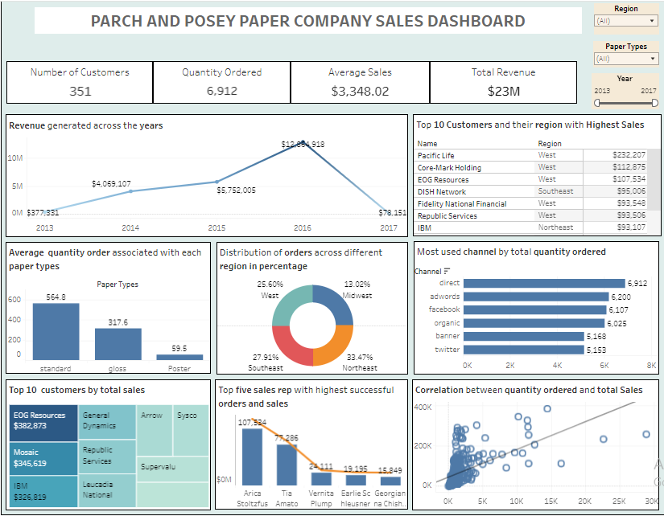

# DATA ANALYTICS STARTER PROJECT

## Analytical Report
<b>Title:</b>  Analyzing Parch and Posey Dataset to Generate Insights for Data-Driven Decision Making  

<b>Introduction:</b> 
The aim of this report is to provide insights derived from the analysis of the Parch and Posey dataset, using SQL queries and visualization techniques. Through this analysis, insights have been generated to identify patterns, trends, and key metrics that can aid in making data-driven decisions for the company. 

<b>Description and Exploration</b> 
Parch and Posey is a company that deals with the sale of three distinct paper type to its clients. The Parch and Posey dataset contains 5 tables with varying number of columns, all linked via primary keys. Each table contains important information on customers, their orders and its characteristic, purchased region, assigned sales representative and channel from which they were integrated into the company. 

The dataset was explored to understand its structure and contents. Data cleaning procedures were implemented to handle missing values and ensure consistency in the data. 

<b>Analytical questions</b> 
<ol>
<li>Top 10 customers by total sales</li>
<li>Top 5 sales representatives with the highest number of successful order and sales</li>
<li>Revenue generated across the year</li>
<li>Average quantity order associated with each paper type</li>
<li>Distribution of orders across different region in percentage</li>
<li>Top 10 customers with highest sales and their region</li>
<li>Total number of customers</li>
<li>Most used channel by quantity order</li>
<li>Popular paper types by total orders and sales among customers</li>
<li>Correlation between quantity ordered, total sales and region</li>  
</ol>

Analytical steps process
1.	Top 10 customers by total Sales: This step involved identifying the top customers by total sales. By analyzing customer purchasing behavior, the company can prioritize high-value clients for targeted marketing and sales strategies.
2.	Top 5 sales representatives with highest number of successful orders and sales: The performance of sales representatives was analyzed to identify top performers. Recognizing and rewarding top sales representatives can incentivize performance improvements across the sales team.
3.	Revenue generated across years: Revenue trends over time were analyzed to identify growth patterns and seasonal variations. Understanding revenue trends helps in strategic planning and resource allocation.
4.	 Average quantity order associated with each paper type: To understand customer preferences, the average quantity ordered for each paper type (standard, gloss, and poster) was calculated. This insight helps in inventory management and product development by identifying the most popular paper types among customers.
5.	Distribution of orders across different regions in percentage: The distribution of orders across different regions was analyzed by calculating the percentage distribution of orders. This insight highlights potential areas for market expansion and targeted marketing efforts based on regional demand.
6.	Top 10 customers and their region with highest sales: Orders were grouped by customer and region, and the maximum total sales amount for each customer in each region was identified. This insight provides visibility into which customers in specific regions contribute the most to overall sales, guiding targeted marketing efforts and regional sales strategies.
7.	Total number of customers: The total number of unique customers was counted. This metric provides a foundational understanding of the customer base and serves as a basis for further analysis and segmentation.
8.	Most used channel by quantity order: The quantity of orders for each channel from web events data was counted, and the channel with the highest quantity of orders was identified. This insight helps in understanding customer engagement preferences and optimizing marketing efforts across different channels.
9.	 Popular paper types by total orders and sales among customers: Orders were categorized into different paper types (standard, gloss, poster), and the total number of orders and total sales amount for each paper type were calculated. This analysis sheds light on customer preferences for paper types and informs inventory management and product development decisions.
10.	 Correlation between quantity ordered, total Sales, and region: Orders were associated with customers and regions, and the total quantity ordered and total sales amount for each customer in each region were calculated. This analysis enables the identification of correlations between quantity ordered, total sales, and region, providing insights into regional sales performance and customer purchasing behavior.

SQL Querying:
SQL queries were utilized to extract relevant data from the dataset based on ten analytical questions aimed at understanding various aspects of the company's operations. These questions covered areas such as sales performance, customer segmentation, regional trends, and web event correlations.
--Top 10 customers by total sales
SELECT a.name AS customers, SUM(total_amt_usd) As Total_sales
FROM accounts a
JOIN orders o
ON a.id = o.account_id
GROUP BY 1
ORDER BY 2 DESC
LIMIT 10;

--Top five sales reps with the highest number of successful orders and sales
SELECT s.name AS sales_rep, a.sales_rep_id, COUNT(o.total) AS orders, 
	   SUM(o.total_amt_usd) AS sales
FROM accounts a 
JOIN orders o ON a.id = o.account_id
JOIN sales_reps s ON s.id = a.sales_rep_id
GROUP BY 1,2
ORDER BY 4 DESC
lIMIT 5;

--Revenue generated across the years
SELECT
		DATE_PART('year',occurred_at) AS year,
		SUM(total_amt_usd) AS Revenue
FROM orders
GROUP BY 1
ORDER BY 1

--Average quantity order associated with each paper type 
SELECT AVG(standard_qty) AS average_standard_quantity,
	   AVG(gloss_qty) AS average_gloss_quantity,
	   AVG(poster_qty) AS average_poster_quantity
FROM orders

--Distribution of orders across different region in percentage
WITH region_orders AS (
SELECT r.name AS region, COUNT(o.total) AS orders 
FROM region r
JOIN sales_reps s
ON r.id = s.region_id
JOIN accounts a
ON s.id = a.sales_rep_id
JOIN orders o ON a.id = o.account_id
GROUP BY region )
SELECT region,orders,
	   ROUND ((orders/SUM(orders)OVER())*100)AS percentage_of_orders
FROM region_orders
ORDER BY orders DESC

--Top 10 Customers and their region with highest sales
SELECT a.name AS Customers, r.name AS Region, 
	   MAX(total_amt_usd) Highest_sales
FROM orders o
JOIN accounts a ON o.account_id = a.id
JOIN sales_reps s ON a.sales_rep_id = s.id
JOIN region r ON s.region_id = r.id
GROUP BY 1,2
ORDER BY 3 DESC
LIMIT 10

--Total number of customers
SELECT COUNT(name) total_customers
FROM accounts

--Most used channel by quantity order
SELECT w.channel, COUNT(o.total) AS quantity_order
FROM web_events w
JOIN orders o
ON w.account_id = o.account_id
GROUP BY 1
ORDER BY 2 DESC
LIMIT 1;

--Popular Paper types by total orders and sales among customers 
SELECT
	CASE
		WHEN standard_qty > 0 THEN 'standard'	
	    WHEN gloss_qty > 0 THEN 'gloss'
		ELSE 'poster'
	END AS paper_type,
	COUNT(total) AS total_orders,
	SUM(total_amt_usd) AS total_sales					
FROM orders
GROUP BY paper_type	

--correlation between quantity ordered, total sales and region
WITH sales_correlation AS (
SELECT a.id AS customer_id, a.name AS customer_name, r.name AS region_name,
	   o.total AS total_order, o.total_amt_usd AS total_sales
	   FROM region r
	   JOIN sales_reps s ON r.id = s.region_id
	   JOIN accounts a ON s.id = a.sales_rep_id
	   JOIN orders o ON a.id = o.account_id
	   GROUP BY 1,2,3,4,5 )
SELECT customer_id, customer_name, region_name,	
	   MAX(total_order) maximum_order,
       SUM(total_sales) total_sales_value
FROM sales_correlation
GROUP BY customer_id, customer_name, region_name
ORDER BY total_sales_value desc
LIMIT 10;

Insight Generated:  
Analysis of the extracted data has led to the generation of insights that provide valuable information for decision-making.  

Key insights include:
1.	Revenue Trends: There has been a surge in revenue over the years, peaking in 2016 before experiencing a decline in 2017, reaching its lowest point.
2.	Sales Performance: Pacific Life from the west region leads in sales, having an impressive sales of $232,207.
3.	Paper Preference: Standard paper has showed to be the top choice as the highest average quantity order, while poster paper being the least.
4.	Regional Orders: Northeast region emerge as the hotspot for orders, closely followed by Southeast, with Midwest recording the least orders.
5.	Top Customers: EOG Resources secures the top spot for maximum total sales, followed by Mosaic and IBM among the top 10 customers.
6.	Sales Representative Performance: Arica Stoitzfus stands out as the top performing sales representative, leading in total orders and sales
7.	Correlation: A correlation between quantity ordered and sales shows the importance of order volume in driving revenue.
8.	Channel: Direct emerges as the most used channel for placing orders, followed by Adwords, with Twitter being the least utilized channel.
9.	Key Performance Indicators (KPIs): Total revenue amounts to $23M, with a quantity ordered of 6,912, a customer base of 351, and an average sales figure of $3,348.02.

Visualization: 

Visualizations were created using a business intelligence tool (Tableau) to present the insights effectively. These visualizations include charts, graphs, and interactive dashboards that provide a comprehensive overview of the analyzed data.
 

Link to Dashboard
https://public.tableau.com/views/DATAANALYTICSSTARTERPROJECT/Dashboard1?:language=en-US&publish=yes&:sid=&:display_count=n&:origin=viz_share_link
Recommendations:
Based on the analysis, recommendations have been formulated:
1.	Allocate resources and marketing efforts towards regions with high order volumes, such as Northeast and southeast, to capitalize on market opportunities and drive sales growth.
2.	Enhance overall performance by providing additional training and support to sales representatives. Recognize and reward top performers like Arica stoitzfus to motivate the entire sales team.
3.	Utilize insights on paper preference to tailor product offerings and marketing strategies. Consider promoting standard paper, with the highest average quantity order, to drive sales and meet customer demand.
4.	Maximize reach and engagement by investing in Direct and Adwards channels, which are the most used for order placement. Explore opportunities to enhance the efficiency and effectiveness of twitter as a sales channel.
5.	Strengthen relationships with top customers such as EOG Resources, Mosaic, and IBM by providing personalized experiences and incentives. Utilize insights to identify and prioritize high-value customers for targeted marketing and retention efforts.
6.	Make use of revenue trends to forecast future sales and plan resources accordingly.
7.	Implement strategies to mitigate potential revenue declines, such as diversifying product offerings or expanding into new markets
8.	Continuously monitoring key performance indicators (KPIs) and adjust strategies based on market trends and customer preferences.
Conclusion
In conclusion, the analysis of the Parch and Posey dataset has provided valuable insights that can inform strategic decision-making for the company. By leveraging data-driven approaches, Parch and Posey can optimize operations, improve sales performance, and enhance customer satisfaction. 
